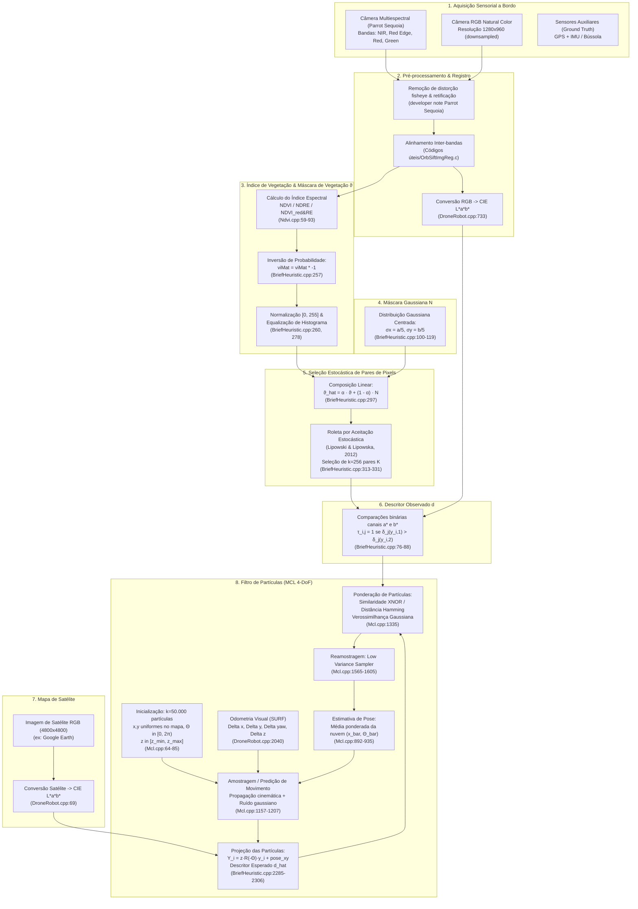

# Arquitetura do Sistema e Pipeline de Dados do λ-BRIEF

Este documento descreve a arquitetura detalhada do sistema **λ-BRIEF**, o fluxo de dados dos sensores até a estimativa de pose em 4 Graus de Liberdade (4-DoF: $x, y, z, \text{yaw}$), e a conexão direta de cada estágio com os módulos de software do repositório.

---

## 1. Visão Geral do Pipeline de Dados

O objetivo do sistema é estimar continuamente a pose global de um veículo aéreo não tripulado (UAV) que sobrevoa regiões agrícolas ou com vegetação intermediária a densa, utilizando unicamente:
1. Imagens aéreas de uma câmera multiespectral embarcada voltada para o solo (nadir).
2. Um mapa orbital/satélite pré-existente em cores naturais (RGB) com georreferenciamento conhecido.
3. Estimativas de deslocamento relativo quadro a quadro (odometria visual via casamento de características).



---

## 2. Etapas Detalhadas e Módulos de Software

### Etapa 1: Aquisição e Alinhamento Multiespectral
- **Dispositivo**: Drone DJI Matrice 100 com sensor multiespectral Parrot Sequoia em montagem fixa apontada para baixo (nadir).
- **Dados Capturados a 1 Hz**:
  - Imagem colorida RGB de alta resolução redimensionada para $1280 \times 960$ (ou $1234 \times 910$ após corte de bordas de retificação).
  - Quatro imagens monocromáticas correspondentes às bandas:
    - **Verde (GRE)**: $550\text{ nm} \pm 40\text{ nm}$.
    - **Vermelho (RED)**: $660\text{ nm} \pm 40\text{ nm}$.
    - **Red Edge (REG)**: $735\text{ nm} \pm 10\text{ nm}$.
    - **Infravermelho Próximo (NIR)**: $790\text{ nm} \pm 40\text{ nm}$.
- **Alinhamento / Registro**: As bandas sofrem correção de distorção de lente (fisheye) e retificação homográfica (`Códigos úteis/OrbSiftImgReg.c` e scripts de pré-processamento). No código C++, `DroneRobot::DroneRobot` carrega os caminhos a partir de `traj.txt`, `traj_RED.txt`, `traj_NIR.txt`, `traj_REG.txt` e `traj_GRE.txt` ([DroneRobot.cpp:353-426](file:///home/vitor-ochoa/Storage/UAVs%20Localization/phir2frameworkv2/DroneRobot.cpp#L353-L426)).

---

### Etapa 2: Espaço de Cores CIE L\*a\*b\*
- **Fundamentação**: Conforme estabelecido no abBRIEF (Mantelli et al.), a luminância $L^*$ é extremamente sensível a sombras, nuvens passageiras e hora do dia. O método descarta $L^*$ e retém exclusivamente os canais de cromaticidade $a^*$ (eixo verde-vermelho) e $b^*$ (eixo azul-amarelo).
- **Implementação**:
  - Imagem do drone: `cv::cvtColor(image, image, CV_BGR2Lab)` ([DroneRobot.cpp:733](file:///home/vitor-ochoa/Storage/UAVs%20Localization/phir2frameworkv2/DroneRobot.cpp#L733)).
  - Mapa de satélite: `cv::cvtColor(originalMap, labMap, CV_BGR2Lab)` ([DroneRobot.cpp:69](file:///home/vitor-ochoa/Storage/UAVs%20Localization/phir2frameworkv2/DroneRobot.cpp#L69)).
  - Configuração: `BRIEF_HEURISTIC_TYPE = 4` em [config.h:55-57](file:///home/vitor-ochoa/Storage/UAVs%20Localization/phir2frameworkv2/config.h#L55-L57).

---

### Etapa 3: Cálculo do Índice de Vegetação (VI) e Máscara $\vartheta$
- **Objetivo**: Delinear a distribuição de vegetação para guiar a amostragem de pixels.
- **Formulação dos Índices**:
  1. **NDVI** (`ndvit = 1`):
     $$\text{NDVI} = \frac{\text{NIR} - \text{Red}}{\text{NIR} + \text{Red}}$$
     Implementado em [Ndvi.cpp:60-70](file:///home/vitor-ochoa/Storage/UAVs%20Localization/phir2frameworkv2/Ndvi.cpp#L60-L70).
  2. **NDRE** (`ndvit = 2`):
     $$\text{NDRE} = \frac{\text{NIR} - \text{RedEdge}}{\text{NIR} + \text{RedEdge}}$$
     Implementado em [Ndvi.cpp:73-81](file:///home/vitor-ochoa/Storage/UAVs%20Localization/phir2frameworkv2/Ndvi.cpp#L73-L81).
  3. **$\text{NDVI}_{\text{red\&RE}}$** (`ndvit = 3`):
     $$\text{NDVI}_{\text{red\&RE}} = \frac{\text{NIR} - (a \cdot \text{Red} + (1-a) \cdot \text{RedEdge})}{\text{NIR} + (a \cdot \text{Red} + (1-a) \cdot \text{RedEdge})}, \quad a = 0.4$$
     Implementado em [Ndvi.cpp:83-93](file:///home/vitor-ochoa/Storage/UAVs%20Localization/phir2frameworkv2/Ndvi.cpp#L83-L93) e [VegetationIndex.h:53](file:///home/vitor-ochoa/Storage/UAVs%20Localization/phir2frameworkv2/VegetationIndex.h#L53).
- **Pós-processamento da Máscara**:
  - **Inversão**: `viMat[i][j] = viMat[i][j] * -1` ([BriefHeuristic.cpp:257](file:///home/vitor-ochoa/Storage/UAVs%20Localization/phir2frameworkv2/BriefHeuristic.cpp#L257)). O objetivo técnico é priorizar regiões com *menor* quantidade de vegetação (onde os índices invertidos são mais altos), pois clareiras e estruturas artificiais oferecem pistas mais estáveis e discriminativas entre anos diferentes.
  - **Normalização e Equalização**: Normalização para $[0, 255]$ via `Utils::Normalize` ([BriefHeuristic.cpp:260](file:///home/vitor-ochoa/Storage/UAVs%20Localization/phir2frameworkv2/BriefHeuristic.cpp#L260)) seguida de `cv::equalizeHist(gray, grayEqualized)` ([BriefHeuristic.cpp:278](file:///home/vitor-ochoa/Storage/UAVs%20Localization/phir2frameworkv2/BriefHeuristic.cpp#L278)).

---

### Etapa 4: Máscara Gaussiana $\mathcal{N}$
- **Objetivo**: Garantir concentração preferencial de pares próximo ao centro ótico da câmera, em consonância com o descritor BRIEF clássico (Calonder et al., 2010).
- **Formulação**:
  $$\mathcal{N}(x, y) = \exp\left( - \left( \frac{(x - x_0)^2}{2\sigma_x^2} + \frac{(y - y_0)^2}{2\sigma_y^2} \right) \right)$$
  com $x_0 = a/2, y_0 = b/2, \sigma_x = a/5, \sigma_y = b/5$.
- **Implementação**: Método `BriefHeuristic::gaussianMask` ([BriefHeuristic.cpp:100-119](file:///home/vitor-ochoa/Storage/UAVs%20Localization/phir2frameworkv2/BriefHeuristic.cpp#L100-L119)).

---

### Etapa 5: Composição e Amostragem Estocástica (Eq. 1 do Paper)
- **Equação 1**:
  $$\hat{\vartheta}_{y_i} = \alpha \cdot \vartheta_{y_i} + (1 - \alpha) \cdot \mathcal{N}_{y_i}$$
  Implementada em [BriefHeuristic.cpp:296-300](file:///home/vitor-ochoa/Storage/UAVs%20Localization/phir2frameworkv2/BriefHeuristic.cpp#L296-L300).
- **Algoritmo de Roleta via Aceitação Estocástica**:
  Proposto por Lipowski & Lipowska (Physica A, 2012), substitui a busca linear $O(N)$ da roleta cumulativa por um teste de rejeição $O(1)$:
  ```cpp
  // BriefHeuristic.cpp:313-331
  for(int pair = 0; pair < totalPairs; pair++) {
      pixelPair = 0;
      while(pixelPair < 2) {
          x = floor(rand() % drone.cols);
          y = floor(rand() % drone.rows);
          random = ((double) rand() / (RAND_MAX));
          if(random < (viMat[y][x] / maximumFitness)) {
              pairs[pair][pixelPair] = cv::Point(x, y);
              pixelPair++;
          }
      }
  }
  ```
  Isso gera um conjunto $K$ de $k=256$ pares de coordenadas relativas de pixels: $p_i = (y_{i,1}, y_{i,2})$.

---

### Etapa 6: Descritor Observado $d$ (Eq. 2 do Paper)
- Para cada par $p_i \in K$ e para cada canal de cor $j \in \{a^*, b^*\}$ ($c=2$):
  $$\tau_{i,j} = \begin{cases} 1, & \text{se } \delta_j(y_{i,1}) > \delta_j(y_{i,2}) \\ 0, & \text{caso contrário} \end{cases}$$
- Resulta em um vetor binário $d$ de comprimento $k \cdot c = 256 \times 2 = 512$ bits.
- Implementado em [BriefHeuristic.cpp:76-88](file:///home/vitor-ochoa/Storage/UAVs%20Localization/phir2frameworkv2/BriefHeuristic.cpp#L76-L88).

---

### Etapa 7: Descritor Esperado $\hat{d}$ por Partícula (Eq. 3 do Paper)
- Para cada partícula $m$ com estado hipotético $\mathbf{x} = [x, y, z, \Theta]^T$, os pares $p_i$ da imagem do drone são reprojetados no sistema de coordenadas do mapa de satélite:
  $$\hat{Y}_{i,b} = z R(-\Theta) \cdot (y_{i,b} - y_{\text{centro}}) + \begin{bmatrix} x \\ y \end{bmatrix}$$
- Onde $z$ é o fator de escala de altitude, $\Theta$ é o ângulo de guinada (*yaw*), e $R(-\Theta)$ é a matriz de rotação horária no plano 2D.
- Os mesmos testes de intensidade nos canais $a^*$ e $b^*$ são aplicados sobre os pixels amostrados do mapa de satélite, gerando o descritor esperado $\hat{d}$.
- Implementado em [BriefHeuristic.cpp:2280-2307](file:///home/vitor-ochoa/Storage/UAVs%20Localization/phir2frameworkv2/BriefHeuristic.cpp#L2280-L2307) e [BriefHeuristic.cpp:2400-2406](file:///home/vitor-ochoa/Storage/UAVs%20Localization/phir2frameworkv2/BriefHeuristic.cpp#L2400-L2406).

---

### Etapa 8: Avaliação de Verossimilhança e Filtro MCL (Eq. 4 do Paper)
- **Comparação de Descritores**:
  O paper define a similaridade como a taxa de coincidência de bits (XNOR):
  $$\xi(d, \hat{d}) = \frac{1}{k \cdot c} \sum_{i=1}^k \sum_{j=1}^c (\tau_{i,j} \odot \hat{\tau}_{i,j})$$
- **Implementação Real no Código**:
  No código ([BriefHeuristic.cpp:2422-2446](file:///home/vitor-ochoa/Storage/UAVs%20Localization/phir2frameworkv2/BriefHeuristic.cpp#L2422-L2446)), calcula-se a taxa de bits divergentes (distância de Hamming normalizada):
  $$\text{diff} = 1 - \xi(d, \hat{d})$$
  E no filtro de partículas ([Mcl.cpp:1335](file:///home/vitor-ochoa/Storage/UAVs%20Localization/phir2frameworkv2/Mcl.cpp#L1335)), o peso $w^{[i]}$ da partícula é atualizado via uma distribuição gaussiana centrada em zero:
  $$w^{[i]} \propto \frac{1}{\sqrt{2\pi \sigma_{\text{brief}}^2}} \exp\left( - \frac{\text{diff}^2}{2\sigma_{\text{brief}}^2} \right)$$
- **Ciclo MCL Completo** ([Mcl.cpp:1157-1605](file:///home/vitor-ochoa/Storage/UAVs%20Localization/phir2frameworkv2/Mcl.cpp#L1157-L1605)):
  1. **Predição**: Propaga partículas usando a odometria visual SURF com ruído gaussiano aditivo em $x, y$, $\Theta$ e escala multiplicativa em $z$.
  2. **Atualização**: Avalia o descritor esperado de cada partícula contra o observado e multiplica os pesos.
  3. **Normalização**: $\sum_i w^{[i]} = 1$.
  4. **Reamostragem**: Executada via *Low Variance Sampler* quando o número efetivo de partículas $N_{\text{eff}} = \frac{1}{\sum (w^{[i]})^2}$ cai abaixo do limiar.
  5. **Estimativa de Pose**: Média ponderada no espaço euclidiano para $(x, y, z)$ e média circular de von Mises para o ângulo $\Theta$ ([Mcl.cpp:892-935](file:///home/vitor-ochoa/Storage/UAVs%20Localization/phir2frameworkv2/Mcl.cpp#L892-L935)).
